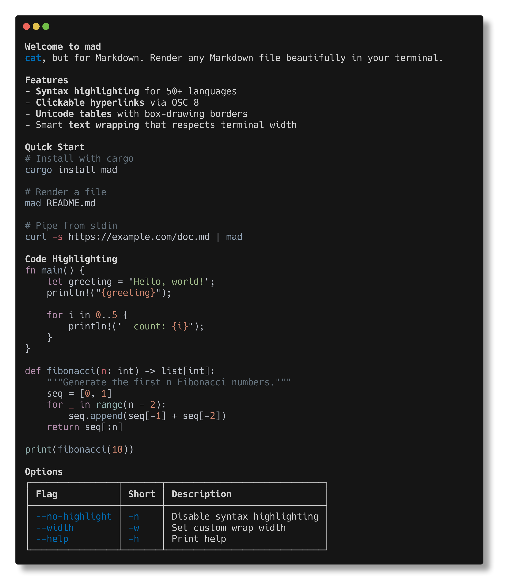
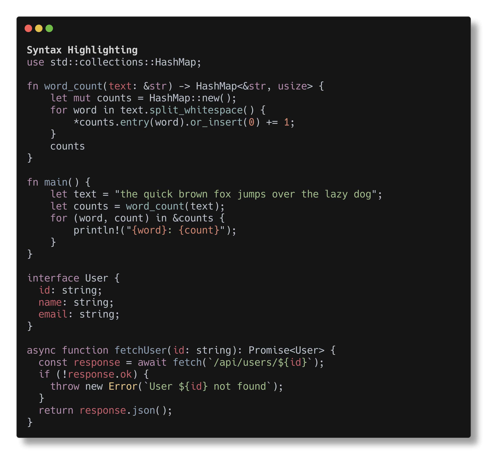
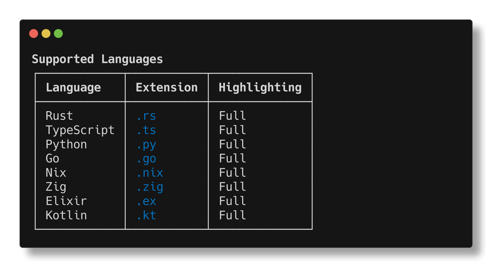

# mad

**`cat`, but for Markdown.** Read any Markdown file right in your terminal -- beautifully.

`mad` renders Markdown as richly formatted terminal output with syntax-highlighted code blocks, clickable hyperlinks, Unicode tables, and smart text wrapping. No browser, no GUI, no friction. Just `mad README.md`.



## Features

- **Syntax highlighting for 50+ languages** -- powered by [syntect](https://github.com/trishume/syntect) with the base16-ocean.dark theme
- **Clickable hyperlinks** via [OSC 8](https://gist.github.com/egmontkob/eb114294efbcd5adb1944c9f3cb5feda) terminal sequences
- **Unicode tables** with box-drawing borders, alignment, and bold headers
- **Smart text wrapping** that respects terminal width and preserves ANSI escape sequences
- **Headings, bold, italic, strikethrough, lists** -- all rendered with proper formatting
- **Reads from files or stdin** -- pipe it, script it, alias it
- **Fast** -- extra syntaxes are precompiled at build time, zero runtime overhead

### Code Highlighting



### Tables



## Installation

### From crates.io

```bash
cargo install mad
```

### With Nix

```bash
# Run it right now, no install needed
nix run github:macalinao/mad -- README.md

# Or install into your profile
nix profile install github:macalinao/mad
```

### As a Nix flake input

```nix
{
  inputs.mad.url = "github:macalinao/mad";

  outputs = { mad, ... }: {
    # Use mad.packages.${system}.default
  };
}
```

## Usage

```bash
# Render a Markdown file
mad README.md

# Pipe from stdin
curl -s https://raw.githubusercontent.com/macalinao/mad/master/README.md | mad

# Set a custom width
mad --width 100 README.md

# Disable syntax highlighting
mad --no-highlight README.md
```

### Options

| Flag             | Short | Description                                               |
| ---------------- | ----- | --------------------------------------------------------- |
| `--no-highlight` | `-n`  | Disable syntax highlighting for code blocks               |
| `--width <COLS>` | `-w`  | Wrap text to specified width (defaults to terminal width) |
| `--version`      |       | Print version                                             |
| `--help`         | `-h`  | Print help                                                |

## Library

The rendering engine is available as a standalone crate: [`markdown-to-ansi`](crates/markdown-to-ansi). Use it to embed beautiful Markdown rendering in your own CLI tools.

```rust
use markdown_to_ansi::{render, Options};

let opts = Options {
    syntax_highlight: true,
    width: Some(80),
    code_bg: true,
};

let output = render("# Hello\n\nThis is **bold**.", &opts);
println!("{output}");
```

## Crates

| Crate                                         | Description                                      |
| --------------------------------------------- | ------------------------------------------------ |
| [`mad`](crates/mad)                           | CLI binary                                       |
| [`markdown-to-ansi`](crates/markdown-to-ansi) | Library: render Markdown to ANSI terminal text   |
| [`ansi-term-styles`](crates/ansi-term-styles) | `no_std` ANSI escape code constants              |
| [`sublime-syntaxes`](crates/sublime-syntaxes) | Precompiled extra syntax definitions for syntect |

## License

Apache-2.0
